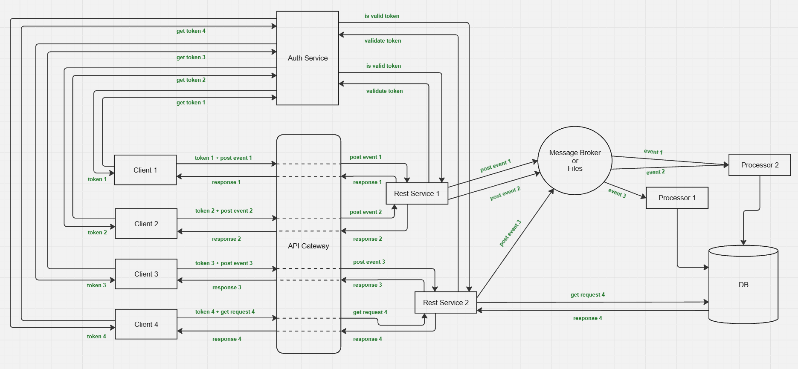

# ETL Pipeline Project

## Contents

- [1. Task Description](#1-task-description)
- [2. Initial Analysis of the Task](#2-initial-analysis-of-the-task)
- [3. Key Questions and Assumptions](#3-key-questions-and-assumptions)
  - [3.1. Client Considerations](#31-client-considerations)
  - [3.2. Data Processor Considerations](#32-data-processor-considerations)
  - [3.3. Server Considerations](#33-server-considerations)
- [4. Proposed Approach](#4-proposed-approach)
- [5. Architecture](#5-architecture)
- [6. Debugging](#6-debugging)
- [7. Testing](#7-testing)
- [8. What's Next](#8-whats-next)

## 1. Task Description

**[See the full task here (ETL.Task/ETL task.pdf)](ETL.Task/ETL%20task.pdf)**

## 2. Initial Analysis of the Task

The assignment outlines a typical ETL pipeline involving clients sending event data, a server persisting those events, and a separate processor loading aggregated data into a database. The general workflow appears as follows:

- Clients send individual JSON event records.
- The server appends these events to a local file in an append-only manner.
- A separate data processor events these files, computes per-user revenue, and updates the database.
- The server also exposes a GET endpoint to retrieve user data from the database.

While this setup resembles common log or metrics processing pipelines, the task’s focus on accurately calculating user revenue introduces additional complexity around consistency and ordering.

## 3. Key Questions and Assumptions

### 3.1. Client Considerations

- **Multiple Client Instances:**  
  The specification does not explicitly clarify whether multiple clients will send data concurrently. For a realistic scenario, it is assumed that multiple clients may submit events simultaneously.

- **Event Distribution Across Files:**  
  It is unclear if events for a single user could be split across multiple client files. This raises questions about event ordering and conflict resolution during processing.

- **Consistency Model for GET Requests:**  
  The GET endpoint is expected to return user data potentially immediately after events are posted. Given the asynchronous nature of the data processor, it is assumed the API provides eventual consistency rather than strong consistency, which better supports scalability and simpler system design.

- **API Endpoint Naming:**  
  The endpoint `/userEvents/{userid}` implies returning raw event data, whereas the database only stores aggregated revenue per user. Renaming this endpoint to `/userRevenue/{userid}` would better align with the data model and expected behavior.

### 3.2. Data Processor Considerations

- **Multiple Event Files:**  
  The task mentions that the data processor must handle multiple event files processed at different times, but it does not specify how these files are generated.

- **Concurrent Processing and Overlapping Data:**  
  If different files contain overlapping events for the same user or time periods, concurrent processing may lead to race conditions or inconsistent database updates.

- **Ordering and Aggregation:**  
  Correctly aggregating revenue depends on processing events in the proper order and avoiding duplicates.

### 3.3. Server Considerations

- **Appending Events to a File:**  
  The requirement to append all events to a single file, combined with the need for multiple files processed by the data processor, introduces complexity. The specification does not clarify how additional files are created.

- **Scalability and Concurrency:**  
  Without further specification, implementing a robust solution that handles concurrent clients, multiple event files, and consistent processing is challenging.

## 4. Proposed Approach

Given the above uncertainties and challenges, it is proposed to use a message broker (e.g., Apache Kafka) to replace the file-based event queue:

- Kafka naturally supports multiple producers and consumers with ordered, durable event logs.
- It simplifies scaling and concurrency, ensuring ordered processing per user partition.
- The data processor can consume events in real time or batch mode without the complexity of file management.

While this deviates from the original file-based design, it offers a more maintainable, scalable, and robust architecture for revenue processing.

## 5. Architecture

Workflow Overview:

- Authentication:
  The client first requests a token from the Auth Service.

- Event Submission:
  The client sends live event data to the REST Service. Multiple instances of the REST Service can run behind an API Gateway, which handles load balancing and service discovery.

- Event Streaming:
  The REST Service publishes incoming live events to the Kafka message broker. It also provides an endpoint for retrieving a user's revenue.

- Event Processing:
  One or more Processor services consume live events from Kafka and update the database accordingly.

**Important:** Retrieving a user's revenue uses an eventual consistency model, so there may be a short delay before recent events are reflected in the reported revenue. As a result, clients might occasionally see slightly outdated values.

## 6. Debugging

- Ensure you have Windows machine, ideally Windows 11
- Ensure you have **VS Code**, **Docker**, and **.NET 9** installed on your system.
- Make sure Docker Desktop is running.
- Clone the repository to your local machine.
- Open the project folder in VS Code.
- Go to the **Run and Debug** menu and select the `Start All` profile.
- Press **F5** to start debugging.

**Note:**  
The first run may take up to several minutes (depending on the machine and internet connection) as Docker pulls the required Kafka and PostgreSQL images. Please be patient while the containers are being set up.

## 7. Testing

- Wait until all live events have been processed and stored in the database (you can monitor this progress in the ETL.Client and ETL.Processor DEBUG CONSOLE).
- Navigate to the `ETL.Tests` folder.
- Run `get-all.cmd` to query the API for all users' revenues.
- Compare the output with the values in `expected-result.txt` to verify correctness. Raw live events can be seen in `ETL.Files/events.txt`.

**Note:**  
Running the system multiple times may change the revenue values, as new live events may be processed and aggregated.

## 8. What's Next

- Add support for both local and remote configuration management.
- Implement comprehensive input validation.
- Improve error handling throughout the system.
- Integrate OpenTelemetry for distributed tracing and monitoring.
- Add OpenAPI (Swagger) documentation for the API.
- Develop unit, integration, performance and end-to-end tests.
- Set up CI/CD pipelines for automated building.

## 9. ENJOY 😊